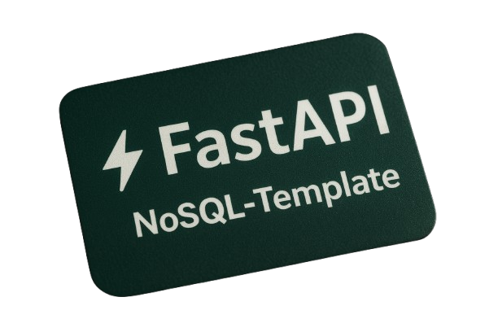

<div align="center">
  
</div>

# FastAPI NoSQL Template

A high-performance, minimalist architecture for asynchronous, NoSQL-native Python web applications and microservices.

## Overview

**FastAPI NoSQL Template** provides a clean, modular foundation for building scalable backends with MongoDB and Redis. Designed with performance and code quality in mind, it delivers zero-ORM overhead, strict type safety, asymmetric JWT security, and native support for both REST and GraphQL APIs.

---

## Core Features

### Engine & Performance
- **Fully Asynchronous**: End-to-end non-blocking I/O across FastAPI, MongoDB, and Redis.
- **Pydantic v2 Integration**: High-speed schema validation and serialization.
- **Dual API Support**: Parallel REST (`v1`, `v2`) and GraphQL (via Strawberry) endpoint structures.
- **Strict Code Quality**: Fully compliant with PEP 8 standards, clean module structures, and 2-space indentation.

### Security & Access Control
- **Asymmetric JWT Authentication**: RS256 token signing powered by private/public RSA keypairs.
- **Role-Based Access Control (RBAC)**: Fine-grained, scope-based permissions for Admin, Seller, and Customer roles.
- **Distributed Rate Limiting**: Dynamic, Redis-backed rate limiting managed via SlowAPI.

### Data Layer & Operations
- **MongoDB Atlas & Local Support**: Smart URI construction supporting standalone MongoDB instances and Atlas (SRV) clusters.
- **Admin Management API**: Specialized endpoints for managing user profiles, role migrations, product catalogs, and system metrics.
- **Caching Layer**: Optimized Redis caching for user sessions and frequent entity lookups.

### Observability & Infrastructure
- **Prometheus Monitoring**: Pre-configured `/metrics` endpoint and structured JSON application logging.
- **Complete Test Coverage**: Unit and integration test suite with full AsyncMock support for MongoDB and Redis operations.
- **Production Orchestration**: Docker Compose configuration paired with an Nginx reverse proxy gateway.

---

## Architecture & Tech Stack

| Layer | Technology | Description |
| :--- | :--- | :--- |
| **Framework** | FastAPI | Asynchronous Web Framework |
| **Language** | Python 3.11+ | Type Annotations & PEP 8 Standards |
| **Database** | MongoDB | Async NoSQL Data Persistence |
| **Caching & Rate Limiting** | Redis & SlowAPI | In-memory Data Store |
| **GraphQL** | Strawberry | Python-ic GraphQL Implementation |
| **Security** | Authlib & PyJWT | OAuth2, RS256 JWT, and Password Hashing |
| **Observability** | Prometheus | Application Metrics Instrumentation |
| **Gateway** | Nginx & Docker | Reverse Proxy & Containerization |

---

## Quickstart Guide

### Prerequisites
- Docker and Docker Compose
- Python 3.11+ (if running locally)

### Setup & Execution

1. **Clone the Repository**
   ```bash
   git clone https://github.com/th0truth/fastapi-nosql-template.git
   cd fastapi-nosql-template
   ```

2. **Configure Environment Variables**
   ```bash
   cp .env.example .env
   ```

3. **Generate RSA Keypair for JWT Signing**
   ```bash
   openssl genrsa -out private_key.pem 2048
   openssl rsa -in private_key.pem -pubout -out public_key.pem
   ```
   *Format the key contents into single-line strings with `\n` line breaks and assign them to `PRIVATE_KEY_PEM` and `PUBLIC_KEY_PEM` in your `.env` file.*

4. **Launch Application Stack**
   ```bash
   docker compose up --build
   ```

---

## Operations & Scripts

| Script Command | Purpose |
| :--- | :--- |
| `bash scripts/build.sh` | Build production-ready Docker images |
| `bash scripts/run.sh` | Start the full application container stack |
| `bash scripts/clean.sh` | Stop containers and prune unused networks and volumes |

---

## GraphQL Interface

Access the interactive GraphQL IDE at `/graphql` to execute combined queries:

```graphql
query GetSystemOverview {
  user(username: "admin") {
    username
    email
    role
  }
  products(category: "electronics") {
    title
    brand
    price
  }
}
```

---

## Code Quality & Indentation

The codebase strictly adheres to **PEP 8** style guidelines:
- Default 2-space indentation width.
- Enforced line length restrictions ($\le 88$ characters).
- Explicit vertical spacing before control flow statements (`if`, `while`, `for`, `return`).
- Standardized import order (Standard Library $\rightarrow$ Third-Party $\rightarrow$ Local Application).

### Switching Indentation Width

If your team or project standard requires **4-space indentation**, you can instantly reformat the entire codebase using `ruff`:

```bash
# Reformat entire codebase to 4-space indentation
uv run ruff format --config 'indent-width=4' .
```

To switch back to 2-space indentation at any time:

```bash
# Reformat entire codebase to 2-space indentation
uv run ruff format --config 'indent-width=2' .
```

---

## License

This project is licensed under the MIT License. See the [LICENSE](LICENSE) file for complete details.